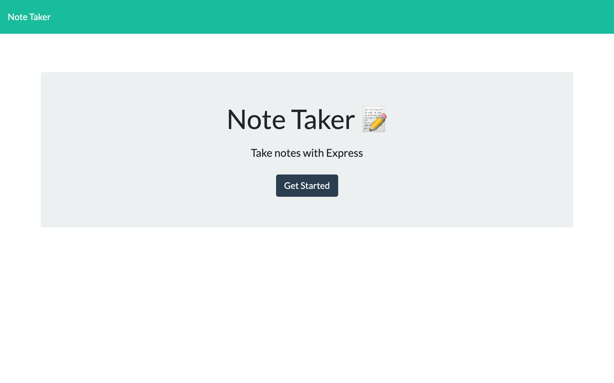
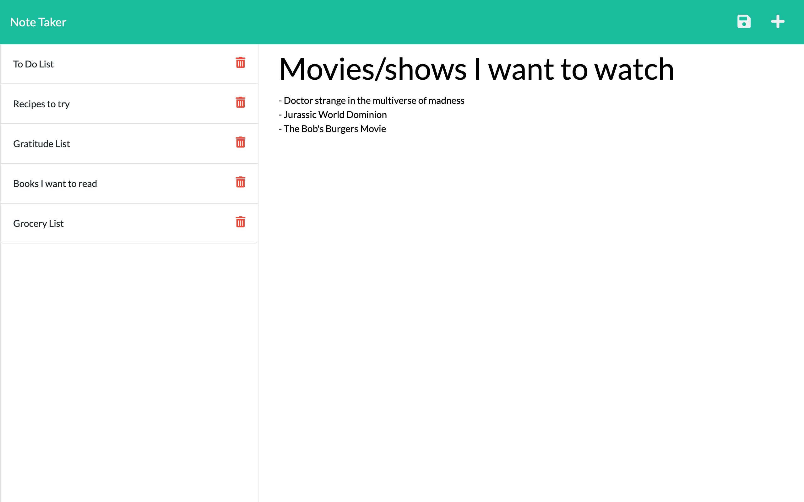

# **Octo Note Taker**

## Description

Octo Note Taker is a simple notes app that allows users to add, save, delete, and stack notes. These actions are made possible through the express.js framework and the HTTP Request methods.

## License

This project is licensed by: MIT.

## Table of Contents

- [Installation](#installation)
- [Usage](#usage)
- [Screenshots](#screenshots)
- [Technology](#technology)
- [Questions](#questions)

## Installation

Click [here](https://octo-note-taker.herokuapp.com) to visit the app.

To view the app locally:

1. Download this repository
2. Go to location of the repository on your compouter
3. Open a terminal in the root (main folder) of the repository
4. Type "npm i" and press enter
5. Type "npm start" and press enter
6. Open browser and type http://localhost:3001/ (if you happen to have something already running on that port the server will automatically jump to the next available port)

## Usage

Users can get started by clicking the get started button on the home page. On the second page users can add saved notes by first typing in the message and then saving the message with the save icon in the upper right hand corner. The user can then add another note by clicking the add note button also in the upper right hand corner.
If the user wants to delete any specific note they can click on the red trashcan icon deleting only that selected note.

## Screenshots

## Technology

- express.js

## Contact

For questions or any other inqurires please contact me at amellis245@gmail.com
or on [Github](https://www.github.com/aellis07).
